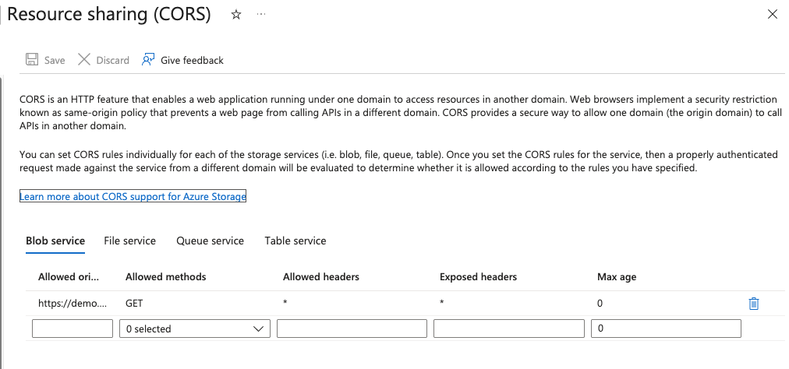

Primero is often deployed on Azure virtual infrastructure. This document should not be considered a deployment guide. It is simply a list of requirements if choosing to use certain Azure components for Primero. Please use the official Azure documentation when designing your local Primero infrastructure such as [networks](https://learn.microsoft.com/en-us/azure/virtual-network/concepts-and-best-practices), [databases](https://learn.microsoft.com/en-us/azure/postgresql), [storage accounts](https://learn.microsoft.com/en-us/azure/storage/common/storage-account-overview), and [secret management](https://learn.microsoft.com/en-us/azure/key-vault/secrets).

## Azure Storage Accounts

- Create a Storage Account scoped to the appropriate subscription and resource group used by your Primero deployment.

Recommended portal steps (administration):

1. In the Azure Portal, go to **Storage accounts** → **+ Create**.
2. Choose the subscription, resource group, name, region and performance tier according to your needs.
3. For `Access tier`, use `Hot`.

### CORS (Cross-Origin Resource Sharing)

If Primero or related services will access blobs from web clients or cross-origin contexts, configure CORS on the Blob service for the storage account:

Portal:

1. Open your Storage Account in the Azure Portal.
2. Under **Data storage**, select **Containers** then click the **Blob service** settings and choose **CORS** (or select **Configuration** → **CORS** depending on UI updates).
3. Add a rule with the appropriate `Allowed origins` (primero_hostname), `Allowed methods` (`GET`), `Allowed headers` (`*`), and `Exposed headers`. (`*`)




Example Azure CLI:

```bash
az storage account create -n "${storage_account_name}" -g "${resource_group}" -l "${location}" --sku Standard_LRS

az storage cors add \
  --methods GET \
  --origins "https://${primero_hostname}" \
  --account-name "${storage_account_name}" \
  --services b \
  --allowed-headers "*" \
  --exposed-headers "*" \
  --max-age 0
```


### Deletion lock for Storage Account

Protect critical resources from accidental deletion by applying a resource lock (Delete) at the storage account or resource group level.

Portal:
1. Open the Storage Account resource → **Settings**  → **Locks** → **Add**.
2. Add a lock with **Lock type** = `Delete`.

Azure CLI example:

```bash
az lock create --name LockSite --lock-type CanNotDelete --resource-group "${resource_group}" --resource-name "${storage_account_name}" --resource-type "Microsoft.Storage/storageAccounts"
```

## PostgreSQL database

Primero requires a PostgreSQL database instance. You can use Azure Database for PostgreSQL (Flexible Server) or self-managed Postgres on an Azure VM. When using Azure DB for PostgreSQL consider high-availability, backups, and performance tiering to match your workload.

Recommended provisioning steps:

1. Provision an Azure Database for PostgreSQL instance in the appropriate network/subnet. For production, prefer `Flexible Server` for better control over high availability and networking.
2. Configure firewall rules or VNet integration so your application servers can connect securely.
3. Enable automated backups and performance monitoring.

### Required PostgreSQL extensions

The following PostgreSQL extensions should be created in the Primero database on Azure:

- `pgcrypto`
- `ltree`
- `pg_trgm`
- `plpgsql`

Enable extensions using `psql` or an administrator connection. Example (run in the target database):

```sql
CREATE EXTENSION IF NOT EXISTS pgcrypto;
CREATE EXTENSION IF NOT EXISTS ltree;
CREATE EXTENSION IF NOT EXISTS pg_trgm;
CREATE EXTENSION IF NOT EXISTS plpgsql;
```

Portal (via Server parameters):

1. In the Azure Portal open your **Azure Database for PostgreSQL** server resource (search by the server name).
2. In the server's **Settings** menu select **Server parameters**.
3. Use the items filter and search for: `azure.extensions`.
4. In the select box that appears, choose the desired extensions (for example: `pgcrypto`, `ltree`, `pg_trgm`, `plpgsql`) and save the changes.

Notes:
- This operation requires server administrator credentials or equivalent permissions.

### Deletion lock for PostgreSQL server

Protect the database by applying a Delete lock to the PostgreSQL resource or to its resource group:

Portal:
1. Open the PostgreSQL server resource → **Settings**  → **Locks** → **Add**.
2. Add a lock with **Lock type** = `Delete`.

Azure CLI example:

```bash

az lock create --name LockSite --lock-type CanNotDelete --resource-group "${resource_group}" --resource-name mydatabaseresource --resource-type "Microsoft.DBforPostgreSQL/flexibleServers"
```